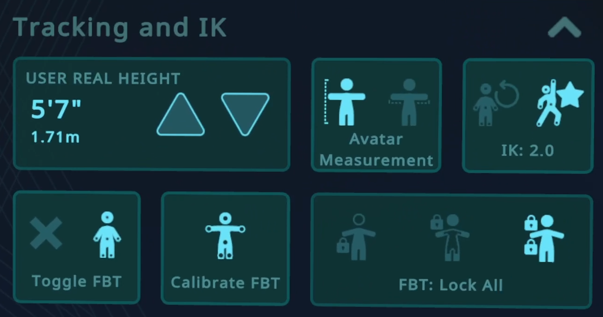
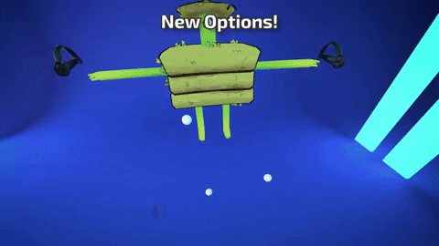
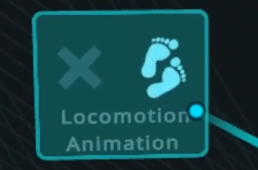

# IK 2.0 功能和选项

IK 2.0是对VRChat跟踪的全面改进。这包括支持更多跟踪点、校准保存、新的 IK 设置等。

重要的是，这些更改不仅适用于全身用户，它们还将改善使用 3 点跟踪的用户行为！

*这是新的 IK 2.0 设置屏幕。您可以在下方看到对多出来的按钮的完整解释。*

## IK 传统版和 IK 2.0 切换

此按钮将在较旧的旧版 IK 行为和新的 IK 2.0 行为之间切换。此切换仅影响 IK 虚拟形象运动。新的跟踪器校准检测和保存方案不会切换到旧行为。

例如，忽略远离身体的跟踪器的新行为不受此切换的影响。此外，无论此切换如何，--校准范围=“0.6”启动选项行为都将起作用。

作为副面效果，虽然目前校准保存也可能在传统模式下工作，但我们无意为这种传统模式添加功能或维护传统模式。**注意：在将来的某个时候，可能会删除此旧版切换开关。**

## 虚拟形象测量

在旧版本的 VRChat 中，所有虚拟形象都是通过手臂跨度来测量的。但是，现在可以通过臂展或虚拟形象高度进行测量。

此测量值用于将虚拟形象与您的现实生活中的身体相匹配。只需在设置之间切换即可找到最适合您的设置。在我们的测试中，按高度测量模式往往更适合全身跟踪。

## 锁类型

这些选项定义了脊柱如何锁定到跟踪器位置。

锁髋关节将严格执行臀部跟踪，并允许头部漂移以避免奇怪的脊柱角度。在此模式下，可选的胸部追踪器行为仅旋转。

锁头将严格执行头部/视图位置，并允许臀部漂移以避免奇怪的脊柱角度。在此模式下，可选的胸部追踪器行为仅旋转。

Lock Both 将严格执行头部和臀部位置，可能会导致奇怪的脊柱或颈部角度以适应这些约束。在此模式下，可选的胸部追踪器行为遵循追踪器的旋转和位置。

## 运动动画

此切换仅在全身和 IK 2.0 模式下显示（在旧版 IK 中不显示）。它可以禁用虚拟形象上的运动动画，以及可能导致全身跟踪出现问题的基础层蹲伏和俯卧动画。

当使用此开关停用运动时，虚拟形象的底层将被静态站立姿势所取代，该姿势在 FBT 中可能表现得更好。在新切换的默认运动活动位置，虚拟形象的现有基础层将像以前一样使用（不变）。这意味着，如果虚拟形象的动画师也禁用了 FBT 运动，那么无论此切换如何，它都将保持这种状态。

## 新的启动选项

**--custom-arm-ratio=“0.4537”** - 调整使用按臂测量模式时用于缩放虚拟形象的比率。“0.4537”是默认值，“0.415”周围的较小值可能会提供更好的拟合。

**--禁用肩部跟踪** - 使用它来避免某些类型的仅基于 IMU 的手臂跟踪器出现问题。

**--enable-ik-debug-logging** - 将有关 IK 的其他输出添加到日志中。在报告 IK 的错误或问题时使用此选项。

**--校准范围=“0.6”** - 确定与校准将搜索的预测支持的结合点的距离（以米为单位）。默认值定义 0.6 米（60 厘米）的球体。这适用于脚、大腿、臀部、上臂和胸部追踪器。

**--断开连接时冻结跟踪** - 启用此选项将导致跟踪器在断开连接时相对于播放器冻结在原位。要移除冻结的跟踪器，您可以再次校准。如果您的所有智能设备都已断开连接，因此校准选项不再可见，则循环使用“虚拟形象测量”选项也将解冻它们。

有关 IK 2.0 引入的新行为、更改和修复的更多信息，请参阅此处的[发行说明](https://docs.vrchat.com/v2022.2.1/docs/latest-release)。