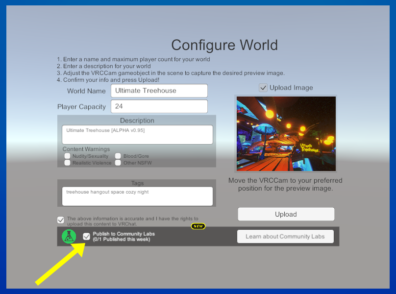
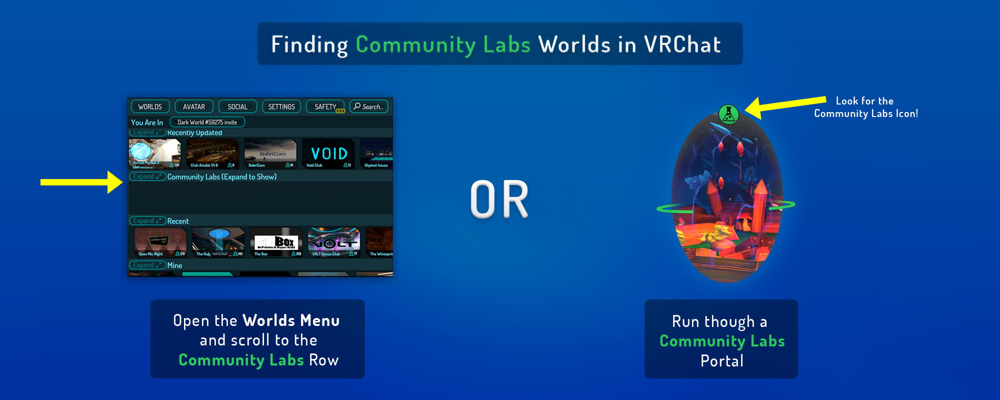
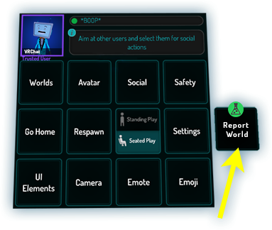
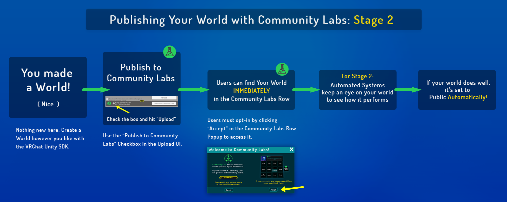

# VRChat 社区实验室

当前状态：第二阶段

> **待处理的更新** 
> 此部分正在等待更新！VRChat菜单最近发生了变化，因此屏幕截图可能不准确。但是功能保持不变。

**社区实验室**是您将您的世界发布进VRChat宇宙的新方式。上传世界时，系统会询问您是否要将世界发布到**社区实验室**。如果您点击同意，您的世界就将被放入社区实验室中。在这里，任何人都可以上传世界（前提是当他们获得了适当的[信任等级](../blank.md)），并允许用户浏览和查找想要探索的内容。

一旦您的世界在社区实验室中待上了足够的时间，在经过系统的判断后，您的世界便将会**自动公开**！

如果您想将世界提交到社区实验室中，您需要在发布您的世界的界面点击如图位置打上对号。一个账号每周只能对一个世界进行提交操作，所以请在提交上传前再三确认！

此外，我们正在改变更新世界的方式。当您选择更新世界时，您的世界将不再从当前公开状态退回为“私人”。这意味着，您可以随时更新您的公开世界而不受影响。

## 探索社区实验室

您可以在“世界”选项卡中找到默认折叠的社区实验室列表。您可以展开它以查看整个社区实验室列表。在展开之前，您会看到一个弹出窗口通知您实验室中的世界尚未审核，因此可能会遇到不当内容。

通往社区实验室世界的传送门有着十分显眼的特殊图标和圆环以助您快速辨别。此外，加载实验室世界时您会收到警告。此警告可让您知道您打算进入的世界在社区实验室中，尚未经过审核。在接收到此警告后，您便可继续加载世界。

如果您发现社区实验室中的某些世界违反了我们的服务条款或社区准则，您可以在快速菜单发现一个快速快捷方式，用于快速举报世界。您可以通过此方式快速提交您认为内容不适宜的的世界报告。此外，如果存在一个极度梦魇般的世界，让您不愿/无法进入，那么您可以在“最近世界”行中找到该世界并反馈报告。

## 发布到社区实验室

允许作者每周向实验室发布一个世界，并且您必须具有至少用户的信任等级才能向实验室提交世界。你可以随时更新你的世界，无论你的世界处于什么状态。如前所述，这也适用于当前处于公共状态的所有世界！

如果你的世界在实验室中表现良好，并且通常有很多好的迹象表明你的世界正在被享受，那么你的世界将自动公开！这个过程是完全自动的。所涉及的因素最好描述为“用户似乎有多喜欢你的世界？如果我们确定人们似乎在享受这个世界，并且没有任何重大问题，你就会被公开。

如果你的世界没有得到很多关注，你的世界可能会在社区实验室中停留相当长的一段时间。出于正当理由举报的世界将从社区实验室中删除，严重时可能会对作者采取审核措施。顺便说一句，就像我们目前的报告系统一样，我们有适当的保障措施来防止“审查轰炸”。

这是一个将世界提交到 VRChat 的全新流程，因此请耐心等待我们处理细微差别。

## 常见问题

**问：我有一个私人世界。如何才能将其放入社区实验室？** 
**答**：只需勾选SDK中的“发布到社 区实验室”复选框，或按VRChat主页上世界页面上的“发布”按钮即可。每周只能发布一次世界。

**问：我发布的世界需要多长时间才能达到公开状态？** 
**答**：世界的审核没有固定的“时间”。您的世界从社区实验室中公开基于许多因素。所涉及的因素可以被抽象描述为“用户有多喜欢你的世界？

**问：将内容上传到社区实验室需要什么信任等级？** 
**答**：您必须至少达到 User 信任等级才能将内容上传到社区实验室。这可能会根据我们在实施社区实验室期间收到的反馈而改变。

**问：世界是否每周只能发布一次？我该怎么在如此严格的限制下进行迭代或更新？** 
**答**：此限制仅适用于发布全新世界的情况。您可以随时更新现有世界，无论它处于什么状态（私人、社区实验室、公共）。您的世界将保持它所处的任何状态。

**问：我有一个目前为公开的世界。我需要担心什么吗？** 
**答**：无需担心！对您来说一切照旧。您的世界已被纳入社区，并被认证为已通过了社区实验室流程。作为额外的奖励，您可以随时更新您的世界，无需等待重新批准。

**问：如果我更新我的公开世界，我会丢失任何东西吗？我会丢失世界统计数据吗？** 
**答**：不会的！您世界的统计数据将会被保留。

**问：我有一个世界，我想将其归类为角色/游戏/等世界。我该怎么做？** 
**答**：我们将来会有系统来更顺利地将一切自动化操作，但目前您必须通过在上传界面提交[“将世界上传为公开”](https://docs.vrchat.com/docs/)表单来实现submitting-a-world-to-be-made-public。它会在世界介绍页面底部显示。

**问：我多久可以将新世界发布到社区实验室？** 
**答**：每周一次（7天）。这可能会根据我们在实施社区实验室期间的反馈而改变。

**问：我多久可以更新一次社区实验室/公开中已有的世界？** 
**答**：随时随地！

**问：这对私人世界会有什么影响 —— 比如，一个我不放入社区实验室的世界？** 
**答**：没有。

**问：一个世界是否有可能永远不会离开社区实验室？** 
**答**：不会的。一个世界可能需要很长时间才能走出实验室（如果它根本不受欢迎的话），但给定无尽的时间，一个世界最终还是会走出实验室。

**问：我的作品可以选择永远留在社区实验室吗？** 
**答**：不行的！您的世界终究会进入公开列表，但这将根据您的世界的受欢迎程度，可能需要一段时间。

**问：社区实验室的内容规则与VRChat的其他内容有什么不同吗？** 
**答**：没有不同。您上传到VRChat社区实验室的内容仍必须遵守社区准则和服务条款。违反这些条款可能会导致您被撤销将世界提交到实验室的能力。

**问：一个世界是如何从社区实验室中失败的？** 
**答**：如果一个世界被举报，这个世界就会被调查。如果某个世界违反了服务条款、存在恶意内容或发送了其他有效报告，则会将其从实验室中删除。公共世界也是如此。

**问：如果我的世界场景在社区实验室中炸了，我该怎么办？** 
**答**：如果您纠正了这个问题 - 比如说，糟糕的性能 - 您可以将您的世界重新提交给实验室。如果您的世界有一些更严重的问题，比如违反服务条款，你可能会发现自己无法向社区实验室提交世界。

**问：VRChat如何防止“报告炸弹”或伪造报告？** 
**答**：我们现在使用与避免用户/世界的错误/不准确报告相同的方法来检测无效报告。这是一个经过测试的系统，为我们提供了很好的服务，并且可以防止恶意用户滥用报告系统。

**问：我有一个公开/社区实验室世界，我想将其恢复为私人。** 
**答**：进入VRChat主页网站，点击取消发布按钮。当您选择重新发布您的世界时，用户仍将在他们的收藏夹中找到您的世界，并且您将保留一些以前的世界统计数据。