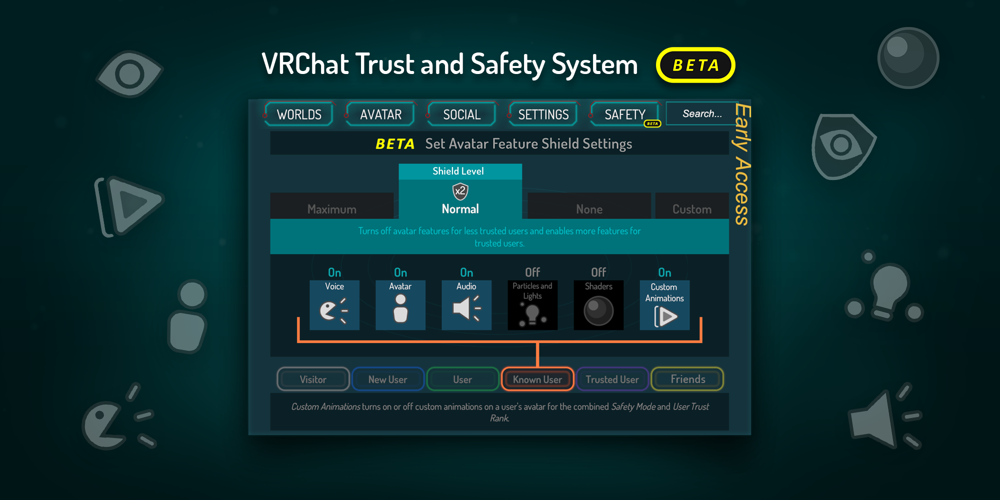
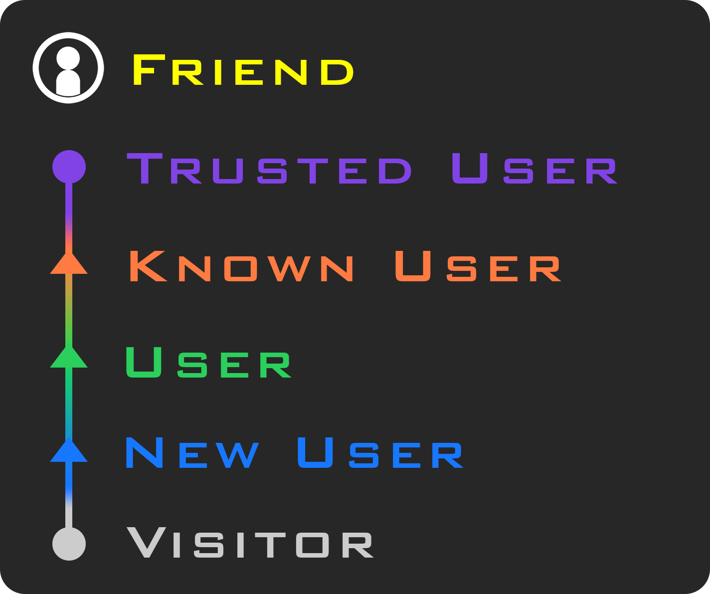
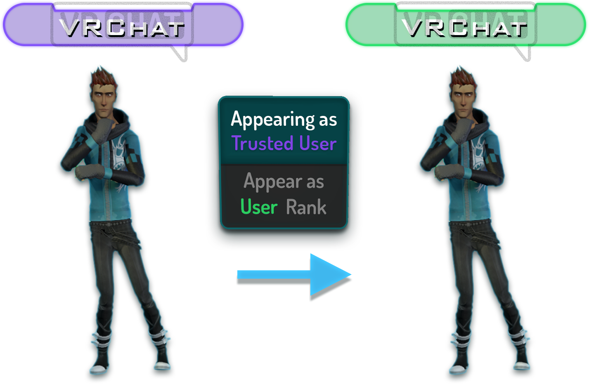
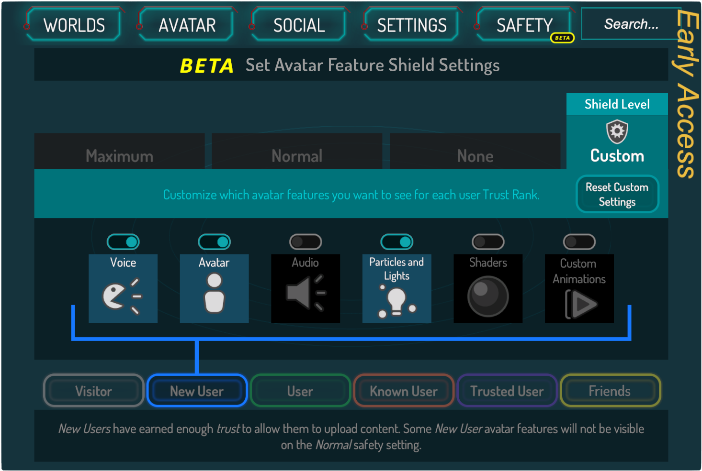
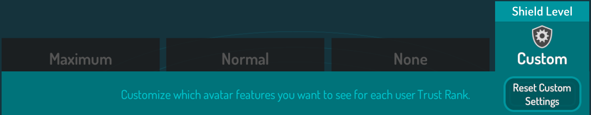
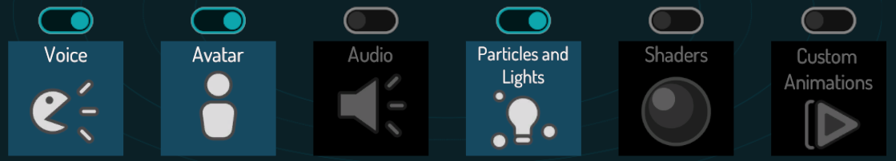
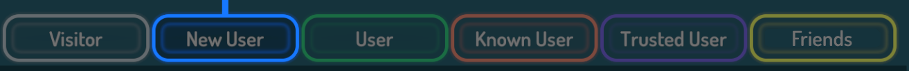
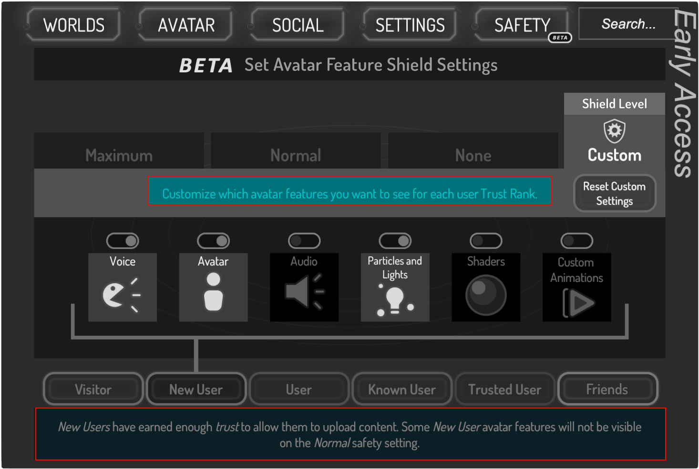
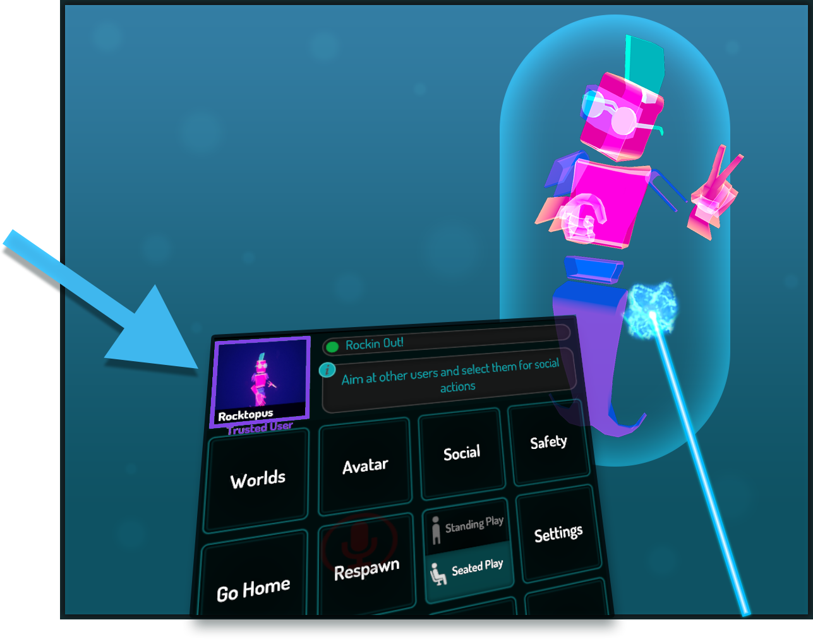
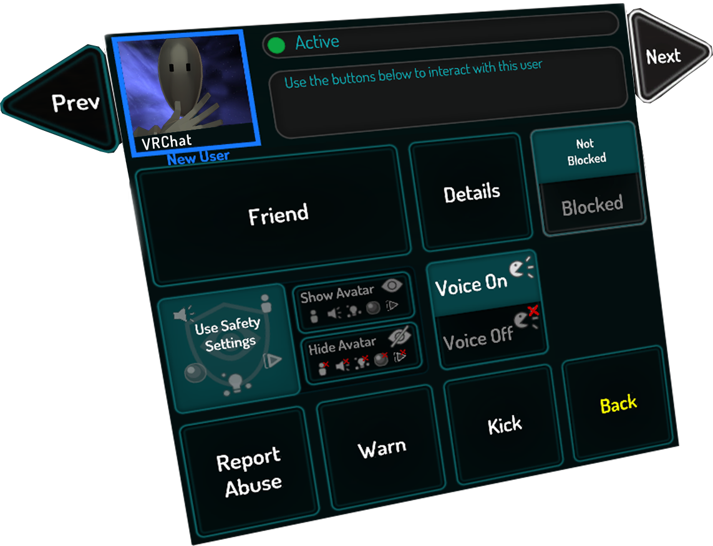

# VRChat安全与信任系统

> **待处理的更新** 
> 此部分正在计划更新！VRChat铭牌和安全系统界面最近发生了变化，因此例图可能不准确。但是功能保持不变。

VRChat安全与信任系统是目前实施的 VRChat Trust 系统的崭新扩展。它旨在保护用户免受特效 shader 、烦人音效或语音、视觉干扰或恶意粒子特效等等的侵扰，这些是滋扰用户用于搞毁您在 VRChat 中的体验的种种手段。

该系统的目的旨在**将体验控制权交还给用户**，允许用户决定他们在何时何地如何看到各种形象功能，如果使用不当，这些功能可能会起到反作用。

请务必注意，此系统目前处于 **BETA** 阶段，可能会随任意给定版本或补丁而更改。

安全与信任系统的设计使您即使保持默认设置，系统也会确保您不会被恶意形象能攻击到。恶意形象的各种功能会被自动屏蔽掉，以便您在元宇宙中获得更加良好的体验。

该系统有两个重要组成部分，即信任系统和安全系统。接下来的部分将更加详细地介绍它们。

## 信任系统

信任系统实际上已经在VRChat中实现！它决定了用户何时才能上传内容 - 您可能听说过我们之前称呼为的“内容门槛”。然而该系统不仅仅可以确定您是否能够上传内容 —— 它还通过用户行为来决定“信任登记”，这是许多变量的总和。我们可以轻松调整计算值，因此我们可以随着时间的推移对其进行调整。

### 信任等级

用户的信任度转化为我们称之为“信任排名”的东西，它表明用户在VRChat上花费了多少时间，他们贡献了多少内容，他们结交了多少朋友，以及许多其他因素。这些等级如下：

您只需玩 VRChat 即可获得这些排名 - 随着您探索世界，结交朋友和创建内容，您将获得更多的信任，这决定了您的信任等级。

当您打开快速菜单时，排名会显示在铭牌上。其他时刻，它们会让开并在正常游玩时不可见。

朋友是一个特殊的信任等级。您加好友的用户的所有形象功能都显示在普通护盾等级中，您可以像自定义任何其他信任等级一样自定义它们。

“**访客**”和“**新用户**”之间的过渡是一个特殊的过程 - 当访客成为新用户时，只要他们使用 VRChat 帐户，他们就可以将内容上传到 VRChat。用户在通过此排名时会收到通知，并被定向到 VRChat 文档页面以开始创建内容。

在将来的版本中，用户在转换信任等级时将收到通知。

从“**已知用户**”及以上级别的所有级别也可以关闭铭牌上的级别显示。他们可以选择将自己的铭牌显示为“用户”，这会将其铭牌转换为用户颜色，并且还**会更改安全系统对待他们形象的方式以匹配用户模板**。这适用于出于任何原因不希望炫耀其更高等级的用户。

默认情况下，**已知**和**受信任**的用户将显示其排名。使用切换会将您恢复为**用户**。

此外，还存在一个名为“**烦扰者**”的特殊等级。这些用户给其他用户带来了不少的问题，当您打开快速菜单时，他们的铭牌上方会有一个指示器。大多数时候，这些用户的形象将被完全禁止。您可能不会经常看到这些用户 - 而这显而易见是一件好事！

最后，游戏中存在“**VRChat Team**”等级，只有 VRChat 团队成员才能够使用。当VRChat团队成员打开“DEV”标签时，您可以选择他们，在快速菜单中查看标签。如果您怀疑带有“DEV”标签的用户是否确实在VRChat团队中，只需打开快速菜单，选择他们，然后查看他们的信任等级。如果形象缩略图下没有显示“VRChat Team”，则该用户不是 VRChat 团队的成员，并且可能试图混淆用户。请随时截取屏幕截图并将其报告给审核团队！

如果VRChat团队成员没有打开“DEV”标签，他们将被显示为普通用户。

### 安全系统有什么作用？

“**安全**”是一个新的菜单选项卡，它允许您配置如何处理每个等级的用户，以在VRChat中为您显示相关设置。这会影响用户在 VRChat 中的许多方面：

- **语音** — 将用户的麦克风静音或取消静音（语音聊天）。
- **形象** — 隐藏或显示用户的形象以及所有形象功能。当形象被隐藏时，它会显示一个“静音”的形象。
- **用户图标** — 控制此信任等级的用户形象可见性。当形象被隐藏时，它会被“审查”并带有马赛克效果。
- **形象音频** — 启用或禁用来自用户形象（而不是麦克风）的声音效果。
- **动画** — 启用或禁用用户形象上的自定义动画
- **着色器** — 禁用后，用户形象上的所有着色器都将恢复为标准着色器。着色器屏蔽系统背后的技术细节在我们的[着色器屏蔽系统](https://docs.vrchat.com/docs/shader-fallback-system)文档页面上有详细说明。
- **粒子和光源** — 启用或禁用用户形象上的粒子系统以及任何光源。这也会阻止线和轨迹渲染器组件。
每个等级都有自己独特的设置预设。为了说明这一点，以下是安全菜单的屏幕截图：

此菜单中有**四个主要元素**需要注意。

顶部的一排叫“**护盾级别**”，这是我们开发的安全系统的预设设置。这些预设应该可以满足大部分需求 —— 但是，您也可以在“自定义”预设中完全自定义它们，这是一种特殊的模式，您可以在其中创建自己的自定义设置。

中间是您选择的**护盾等级**的**真实设置**。它们涵盖了安全系统的每个元素，如果您处于自定义模式，则可以根据需要切换它们。

底部是**每个信任等级的列表**。在您选择了“安全模式”后，你可以选择每个等级，看看该等级的形象功能是如何被安全系统配置的。

安全模式下方**蓝色区域**内的文本会随着您选择不同的模式而变化。**底部的文本**也会随着您浏览菜单而更改，并有助于提示您选中的 UI 元素。

完成此设置后关闭菜单。这些设置将会被应用，您将看到这些设置对您周围的用户形象即刻生效。

我们已经调整好了系统预设，以便大多数用户可以将系统保留为“正常”。大多数用户不必执行任何操作，安全系统将正常工作。如果您希望**根据自己的喜好自定义安全等级**，您可以通过**自定义护盾等级**自由安排。

您可以通过单击菜单右上角的“**重置自定义设置**”来**重置自己的自定义设置**。

最后，您可能会注意到系统中“安全模式”的设置已消失。那是因为它们已被吸收到安全系统中。按下安全模式的按键绑定（桌面上的 Shift+Esc，VR 中的两个触发器 + 两个菜单按钮）会将您的护盾等级更改为自定义，并关闭所有等级的所有设置。此行为目前会擦除您的自定义设置，我们计划在未来的更新中实施专用的“安全”护盾级别。

### 隐藏或显示特定用户

您可能会遇到一些尽管有着较高信任等机但在使用着您不愿意看到的形象的用户。您可以**选择该用户，然后在其社交面板中选择“隐藏形象”**。这将隐藏该用户的形象并禁用除语音以外的所有功能。您只需再次单击该按钮即可重新启用玩家的形象和功能，该按钮被标记为“显示形象”。

如果您想将显示形象的控制权返还给安全系统，只需单击“使用安全设置”。

**如有必要，您可以禁用整个系统。** 选择“无”护盾等级将显示每个等级的几乎所有功能，或者创建一个自定义护盾等级，其中包含所有等级的所有功能。但是，我们不建议使用此设置，除非您信任目前房间的每个人。这并不会影响 Nuisance 用户继续被屏蔽 —— 除非您明确取消隐藏它们，否则他们将始终隐藏所有内容。

**您可以通过两种方式按用户重写这些设置。** 第一种方法是选择一个被当前安全设置隐藏其形象或功能的用户，找到“显示形象”，然后单击它。这将显示形象和所有形象功能，无论您当前处于什么安全模式。“隐藏形象”的作用恰恰相反——无论你在什么安全模式下，该用户的形象都会被隐藏。选择“使用安全设置”，让您使用的安全模式管理该用户的形象可见性。

第二种方式是直接交朋友！**好友在普通护盾等级中没有隐藏任何功能。** 我们会假设您默认完全信任您的朋友们。因此，他们的形象功能将在预设护盾等级中完全开启。如果出于某种原因，您想隐藏朋友的形象，您仍然可以使用“隐藏形象”按钮进行操作。

## 安全模式

根据您使用的[控件](.OVERVIEW/contorls/index.md)，有一个快捷方式可以立即禁用您周围所有用户的所有功能。这被称为“**安全模式**”。

在 VR 设备上，同时拉动两个触发器并按下两个菜单按钮将会启用此模式。在PC上，同时按下 Shift 和 Esc 将启用此模式。

启用后，安全系统将被设置为自定义模式，并关闭所有用户的所有功能。文本将出现在屏幕中间，解释刚刚发生的事情。如果您以使用的上一个安全模式是自定义模式，此操作将直接覆盖您的自定义设置。所有用户的所有形象都将被隐藏，用户的所有语音都将被禁用。

要想关闭安全模式，请将安全系统设置回您使用的上一个模式。如果您使用的是自定义模式，则需要手动将设置重置回安全模式前的状态。

## 快速菜单“扫描模式”

当您打开快速菜单时，您将能够看到有关用户铭牌的更多信息，以及查看有关用户的信息。它充当“扫描仪”，在快速菜单打开时提供更多信息。如果您指向用户，您将获得此用户的基本快速信息。单击用户将显示更多详细信息。这将显示他们的形象缩略图，他们的名字，他们的优化等级以及其他信息。

### 与用户交互

正如您在左上角看到的，当您使用扫描模式指向用户时，面板将显示用户的形象封面和名称。他们的信任等级显示在他们形象缩略图的下方，并且缩略图会以适当的颜色突出显示。在右侧，您可以看到他们的当前状态。状态下方的文本框是一个“小提示”，它将根据您指向的内容为您提供有用的信息。

选中用户会拉出更详细的社交菜单。

使用此菜单还可以向用户发送好友请求，打开和关闭其语音，以及查看用户的详细信息（这将显示该用户的完整社交菜单）。单击“未屏蔽”/“已屏蔽”按钮将切换用户的屏蔽状态。

单击顶部的“上一个”和“下一个”，您可以滚动浏览房间中的所有用户。这对于您了解您对用户做了何种设置、您静音了谁、以及您的朋友是谁等非常有用。

“警告”和“踢出”是当您是房主时可用的按钮 - 它允许您根据您的所需调整房间人员。“返回”将带您回到上一个菜单页面，而这大概率会是快速菜单。

### 隐藏和显示形象

在社交快速菜单中，单击“使用安全设置”将允许您选择安全模式来确定如何显示该用户的形象。选择“显示形象”或“隐藏形象”将覆盖您当前的安全模式设置，并显示/隐藏形象和所有功能。

点击“显示形象”是覆盖单个用户护盾等级的最简单方方式！

### 铭牌

在大多数时刻，安全和信任系统不会影响到您的体验。也就是说，用户的信任等级仅在您打开快速菜单时可见。

铭牌左上角指示该用户的信任等级。同样，此文本仅在您打开快速菜单时显示。

## 信任系统如何运作？

信任系统的内部工作原理不宜透露，以此阻止玩家有意利用这个机制。无论如何，提高等级的最好方法就是玩VRChat —— 花时间探索、结交朋友和创作内容（一旦您获得了创作许可）都可以帮助您提高您的信任等级，并会展示您形象的更多功能。

我们想指出有这么几件事不会提高您的信任等级：

- 在房间内呆呆站立或挂机（AFKing）。
- 上传大量粗糙劣质的内容。
- 加一大堆的好友。

## 我该如何保护自己免受恶意用户的侵害？

我们构建了一个经久耐用的系统，它能够检测和缓解对用户声誉的攻击。虽然我们无法分享具体是如何缓解这些类型攻击的确切细节，但我们都做好了准备，并且可以轻松调整参数以适应我们没有预见到的潜在问题。我们已经为这些类型的问题做好了准备，并有能力快速适应不断出现的问题。